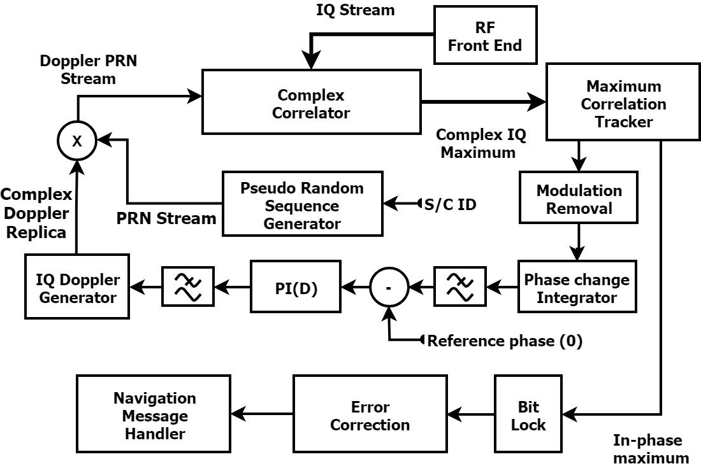

# py-sdr-gps-L1
This is a project that I did to get some more experience of SDR receivers and real-world signal processing.
During this work, I have refrained from looking at other related implementations and have tried to solve issues on my own. Hence some parts of the receiver might seem a bit unconventional and possibly overly convoluted. That being said, this project has provided me with much insight, and it has been a lot of fun! This readme file contains a brief description of some of the key components and concepts of the project.

### Scope
This project is limited to receiving the data bits of the navigation message, however, since the offset of the PRN is known and the fields of the navigation message give the spacecraft ephemeris it is technically possible to get location data from the output of the program. The receiver cannot run in real time and processes a single GPS satellite at a time.

## RF Front End
I used the RTL-SDR which is a 30$ SDR receiver (Including *Swedish* VAT!) based on the now classic RTL2832U receiver chip. I used a sampling rate of 2MS/S which is close to the limit of the RTL-SDR. I used an active GPS antenna powered directly from the 5V bias tee of the RTL-SDR. I used GNU radio to dump the samples into a file as IQ interleaved signed int16 samples (This is the format that the program expects).  The file is far to large to upload to GitHub, however, a similar capture *2013_04_04_GNSS_SIGNAL_at_CTTC_SPAIN* can be found . It is captured at twice the sampling rate but the file format is the same (Interleaved 16 bit signed int).  

## Single correlation design
As the signal is received it is divided into chunks of size 2*1024 IQ-Samples (I.e. two PRNs with unknown offset), these samples are then cross-correlated to the incoming signal. The correlation is next scanned for the maximum. If the received noise contains the signal three will be correlation and the offset of the correlation will be time offset of the signal. This time offset is ultimately what is used to determine the distance to the satellite (All satellites transmit their PRNs at exactly the same time). Once a signal has been detected, it's correlation maximum is feed to a doppler tracking algorithm.

## Doppler frequency and Correlation

The argument of the complex correlation maximum will that of the phase of the heterodyne beat of the Doppler modified pseudorandom sequence and the Heterodyne beat between the LO receiver, and the Doppler shifted LO of the sending satellite.

Under certain conditions  can be used to create an integral of the phase difference between the two signals.

The phase integral can now be used as an error signal for a PID controller which controls the local estimation of the Doppler frequency.  The phase integral and doppler generator form a feedback loop as illustrated in the following figure

  

## Locking onto the bitstream
Each bit is encoded using 20 PRNs, to get a basic bit lock I used this metric to find transitions that are dividable by 20 with a zero remainder (I.e 20, 40,60,80..120 etc ). Once such a transition is seen a confidence counter is increased. This way the receiver locks onto the bitstream, if there is noise it is ignored due to the previously achieved lock. However, merely locking onto the bitstream does not provide information about where we are in the bitstream, for this purpose the bitstream contains preambles which we can scan for. Note, however, that the preambles occurs at other places in the data and can only be accepted after checking the parity of the preamble and adjacent data

